# Laract: Blog Platform

## 🚀 About the Project
**Laract** is a modern and dynamic blogging platform built with:
- **Laravel 12** (Backend)
- **React** (Frontend) using Inertia.js
- **Tailwind CSS** (Styling)


## ✨ Features
- 📝 Create, edit, and delete blog posts
- 💬 Commenting And Like system
- 🔐 User authentication with Laravel Breeze & Inertia.js
- 🔎 Global search functionality
- ⚠️ Alerts and popups using SweetAlert2
- 🌙 Dark mode support
- 🏗️ Admin panel for managing blog posts

## 📌 Installation Guide

### Prerequisites
Ensure you have the following installed:
- PHP 8.2+
- Composer
- Node.js & npm
- MySQL or SQLite

### 1️⃣ Clone the Repository
```sh
git clone https://github.com/DarshilNaliyapara/Laract.git
cd Laract
```

### 2️⃣ Install Dependencies
```sh
composer install
npm install
```

### 3️⃣ Set Up Environment
```sh
cp .env.example .env
```
Configure your database & Pusher credentials in the `.env` file.

### 4️⃣ Generate Application Key
```sh
php artisan key:generate
```

### 5️⃣ Run Migrations 
```sh
php artisan migrate 
```

### 6️⃣ Start the Development Server
```sh
php artisan serve
npm run dev
```

## 🔧 Configuration
- Update `.env` with your **Database credentials**.
- ensure it's running: `php artisan queue:work`.

## 🖥️ Frontend Setup
The frontend is built with **React** and **Inertia.js**. To run it separately:
```sh
cd resources/js
npm install
npm run dev
```

## 📷 Screenshots
### Homepage:
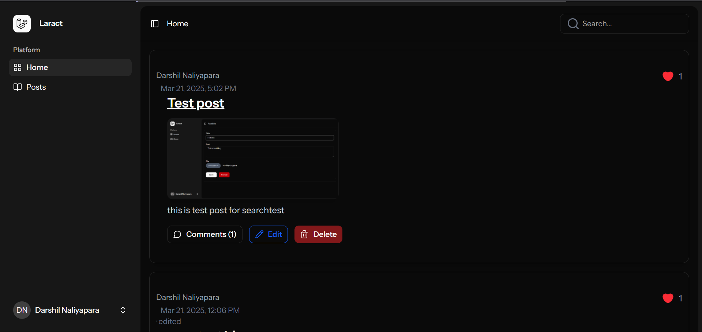

### Guest View:
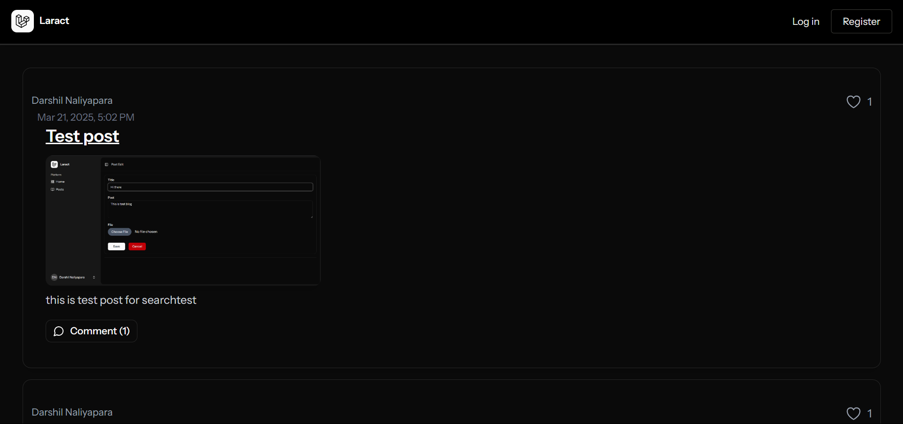

### Dashboard:
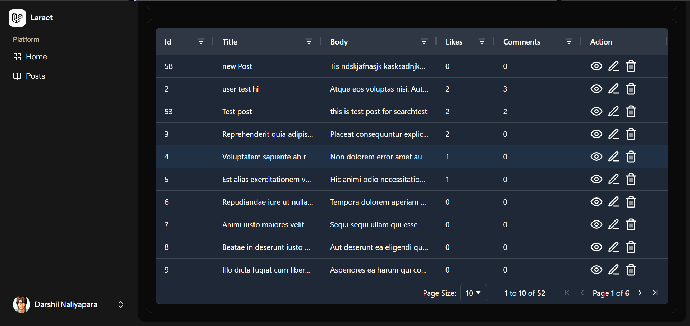

### Blog Post View:
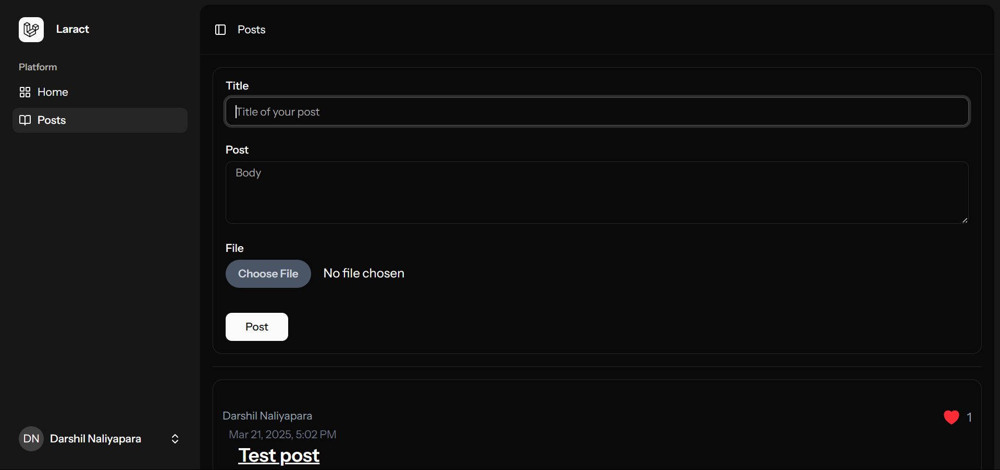

### Edit Post (With Image Preview):
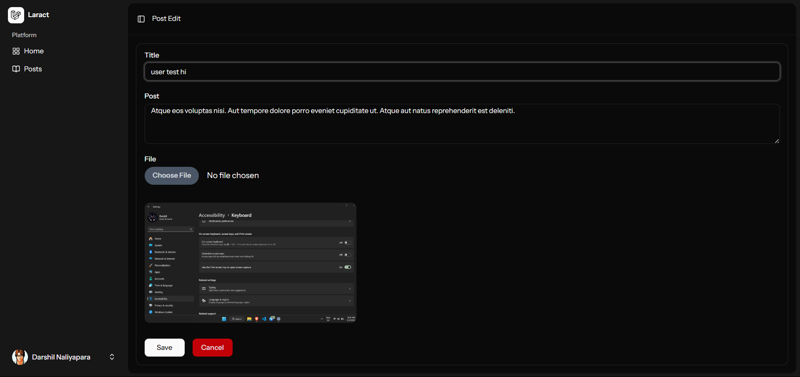

### Blog Comment Section:
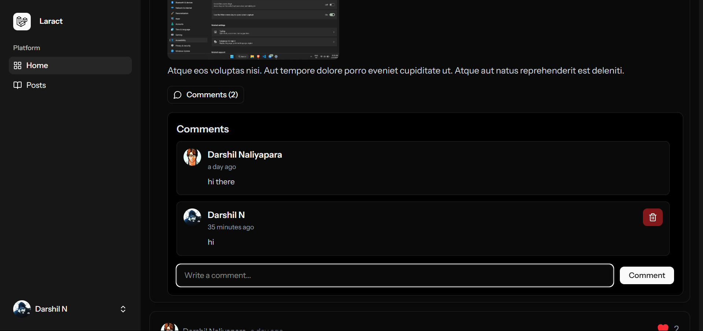

### Blog Search:


### SweetAlert2:
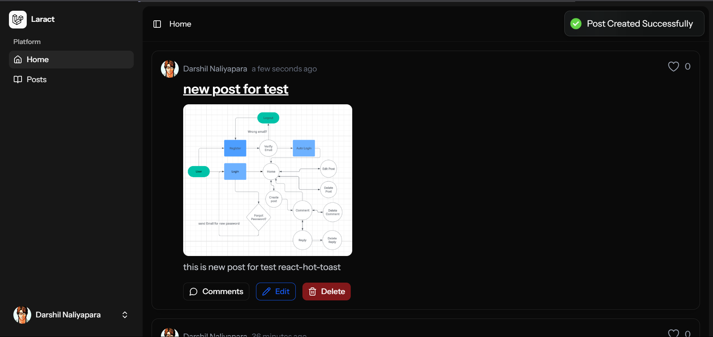

### Login Page:
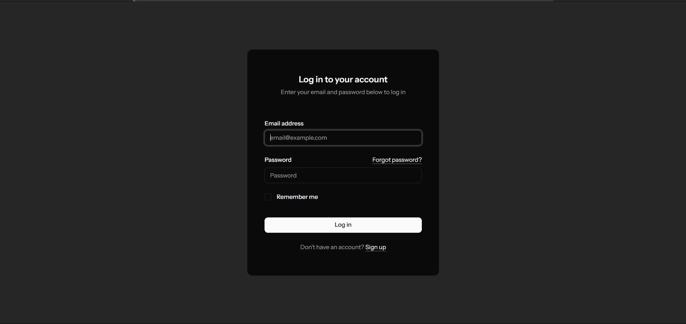

### Register Page:
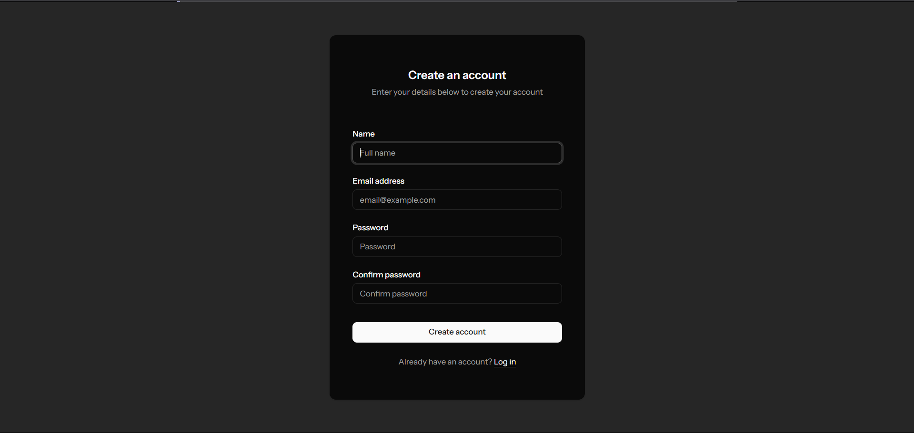

### Email for Verification:
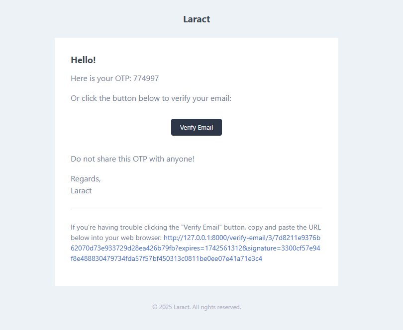

### Email Verification Mail Page:
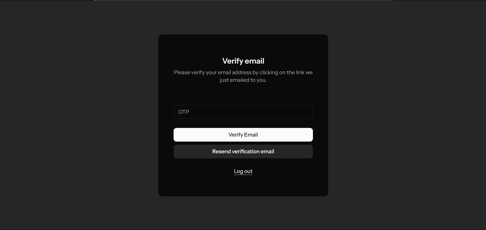


## 📜 License
This project is licensed under the [MIT License](LICENSE).

## 🙌 Contributing
Pull requests are welcome! Please follow the standard contribution guidelines.

## 📧 Contact
For any inquiries, reach out to [darshil6675@gmail.com](mailto:darshil6675@gmail.com).

